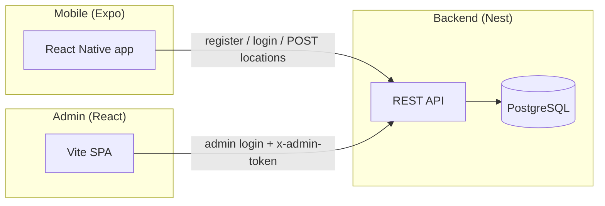

# Project overview

This repository contains a **take-home “spy” assignment** implementation: a harmless-looking **mobile app** (React Native / Expo) that reports GPS locations to a **NestJS + PostgreSQL** backend, plus an **admin dashboard** (React / Vite) to review users and their movement history.

It is **not** production-hardened security-wise: treat it as a demo / portfolio piece.

---

## Repository layout

| Path | Role |
|------|------|
| `abilio-solution/app/` | React Native (Expo) mobile client (“cover” UI + tracking) |
| `abilio-solution/backend/` | NestJS API, TypeORM migrations, seeders, static dashboard mount at `/dashboard` |
| `abilio-solution/admin/` | React admin SPA (Vite): login, user list, trajectory table, Google Map + road snap |
| `docker-compose.yml` | Postgres + backend image (builds admin into backend `dist/admin-ui`) |
| `DEVELOPMENT.md` | How to run from scratch (shorter, mixed PT/EN notes) |

---

## Architecture (high level)



- **End users** register/login and **POST** GPS fixes to `POST /locations`.
- **Admins** `POST /admin/login`, receive a **session token**, then call protected routes with header `x-admin-token`.
- **Admin UI** is available either:
  - **Behind the API** at `http://<api-host>:3000/dashboard` (production Docker build uses `VITE_BASE=/dashboard/`), or  
  - **Standalone Node static server** on **`ADMIN_STATIC_PORT` (default `3001`)** after `npm run build` in `abilio-solution/admin` (uses `VITE_BASE=/`).

---

## Backend (`abilio-solution/backend`)

### Stack

- NestJS 11, TypeORM, PostgreSQL, `bcrypt`, `class-validator`
- Global validation pipe (whitelist + forbid unknown fields)
- CORS enabled; exposes `x-admin-token` for browser clients

### Main HTTP areas

- **`/users`** — app user register/login; last location & history (see `users.controller.ts`)
- **`/locations`** — ingest coordinates from the mobile app
- **`/admin`** — admin login, list users with stats, per-user trajectory (JSON + GeoJSON)
- **`/dashboard`** — static files (built admin) when served from the Docker/production layout

### Admin auth model

- `AdminService.login` validates email/password and issues an in-memory token via `AdminAuthService` (single-server demo pattern).
- Protected admin routes use `AdminTokenGuard` reading `x-admin-token`.

### Database

- Migrations live under `src/migrations/`.
- **Seeders** (idempotent admin creation; reset demo users):
  - `npm run seed:porto` — `porto@test.com` + Porto trajectory
  - `npm run seed:lisboa` — `lisboa@test.com` + Lisbon trajectory
  - `npm run seed:all` — both

Docker entrypoint runs migrations and, by default, both seeders (`RUN_SEED=true`).

---

## Admin web (`abilio-solution/admin`)

### Stack

- React 19, Vite, TypeScript
- `@react-google-maps/api` for map + polyline
- **Roads API — Snap to Roads** (`interpolate=true`) to align the polyline to real roads (same Google API key project must enable **Roads API**)

### Environment

| Variable | Purpose |
|----------|---------|
| `VITE_API_BASE_URL` | Nest API origin (defaults in code to current hostname + `:3000` if unset) |
| `VITE_GOOGLE_MAPS_API_KEY` | Maps JavaScript API + Roads API (same Cloud project) |
| `VITE_BASE` | Vite `base` path: `/` for standalone static server; `/dashboard/` when embedded behind Nest |

### Serve production build on a **different port** (Node)

From `abilio-solution/admin`:

```bash
npm install
cp .env.example .env
# set VITE_API_BASE_URL to your API (e.g. http://localhost:3000)
npm run build
npm run start
```

Default static port is **`3001`**. Override:

```bash
ADMIN_STATIC_PORT=4173 npm run start
```

Implementation: `server.mjs` (Node `http` only, no extra dependencies).

---

## Mobile app (`abilio-solution/app`)

- Expo / React Native “cover” experience + location tracking (see `RUN.md` in that folder).
- Configure `EXPO_PUBLIC_API_URL` to reach the backend (use LAN IP for physical devices).

---

## Docker (full stack)

From repo root:

```bash
docker compose up -d --build
```

- **Postgres**: `5432` (configurable via `DB_PORT`)
- **Backend**: `3000` (API + admin at `http://localhost:3000/dashboard` when embedded build is used)

The backend image **builds the admin** with `VITE_BASE=/dashboard/` and copies assets to `dist/admin-ui`.

---

## Default demo accounts (after seed)

| Role | Email | Password |
|------|-------|----------|
| Admin | `admin@example.com` | `admin123` |
| User (Porto) | `porto@test.com` | `123456` |
| User (Lisboa) | `lisboa@test.com` | `123456` |

---

## Trade-offs & limitations

- **Admin token** is stored in memory on the server process (resets on restart; not suitable for multi-instance production).
- **Google Maps / Roads** require a billed Google Cloud project for typical usage; keys must be restricted appropriately in real deployments.
- **Snap to Roads** improves road-following but is not identical to full turn-by-turn **Directions** routing.
- Mobile **background location** has platform limits (Expo Go vs dev client); see `abilio-solution/app/RUN.md`.

---

## Further reading

- `DEVELOPMENT.md` — quick start / docker / local commands  
- `abilio-solution/backend/README.md` — API + migration commands  
- `abilio-solution/app/RUN.md` — Expo run instructions  
